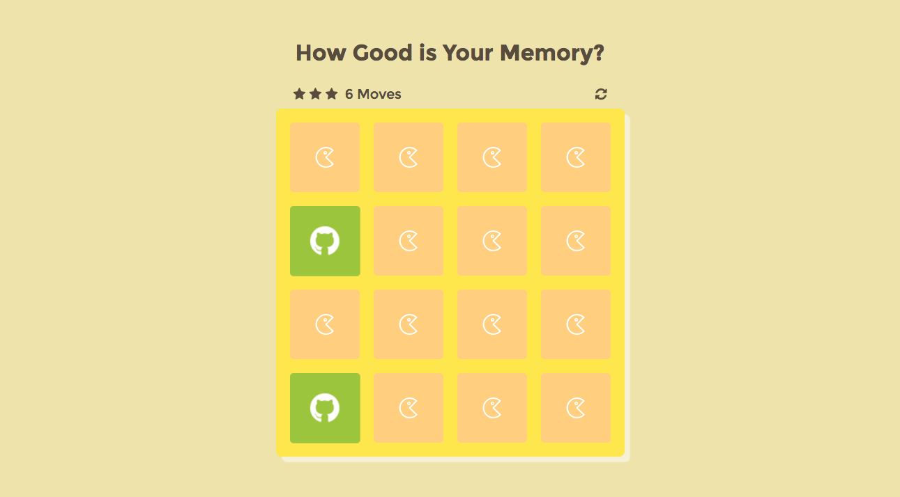

# Memory Game
The image match game is built using mostly javascript, with functions to shuffle, lay out in the grid, flip cards and set scores.  

## 2 plugins I used on this practice:
[Animate.css](https://github.com/daneden/animate.css) to create a flipping card animation.

[SweetAlert2](https://limonte.github.io/sweetalert2/) to display a popup box after completing the game.  

[View Demo](https://chinyi3005.github.io/100websites/17-memory-game)

