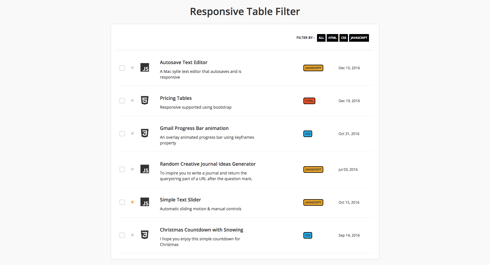

# Responsive Table Filter

This challenge is to create a simple filtering by data attribute values using jQuery, however the most difficult part of table layout would be RWD. Just drag window to see the effect, columns will collapse into a list on small screens.

[**View Demo**](https://chinyi3005.github.io/100websites/22-table-filter)

