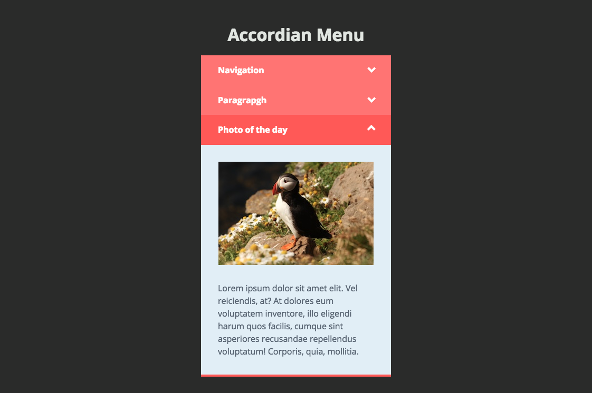

# Accordion Menu

An animated accordion using CSS and jQuery. I make use of some DOM traversal methods to add a little indicator icon to show whether a section is expanded or collapsed. 

[**View Demo**](https://chinyi3005.github.io/100websites/26-accordion-menu)

