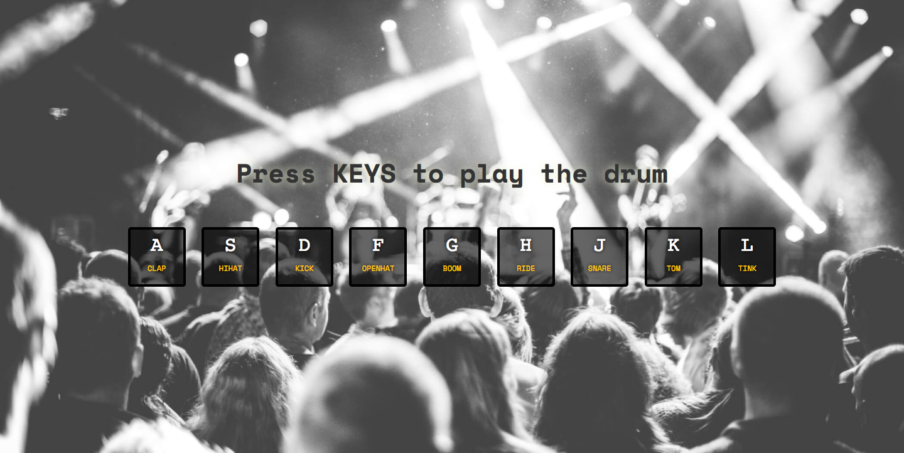

# Drum Kit
Tap your keyboard to play the drum! It's all made with vanilla JS. I learned about using keydown event handler and interacting with audio elements.  

[**View Demo**](https://chinyi3005.github.io/100websites/25-drumkit)

