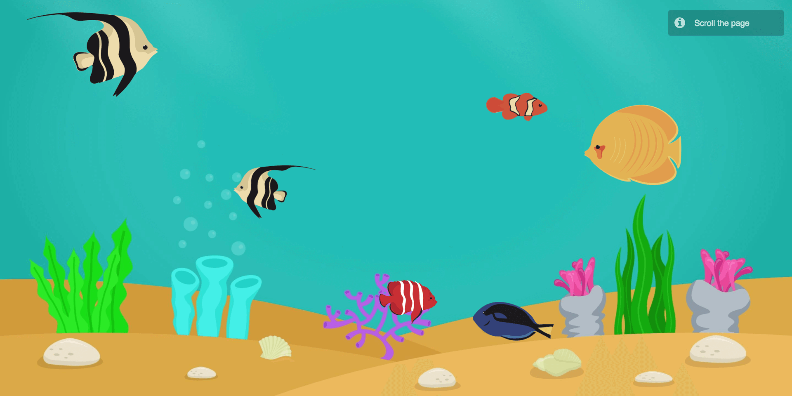

# Parallax Scrolling Aquarium

Scroll down the page to see fishes swimming around. While the background is fixed, with `pageYOffset()` property in javascript, I learned how to manipulate a parallax scrolling effect website. 

[**View Demo**](https://chinyi3005.github.io/100websites/27-parallax-aquarium)

