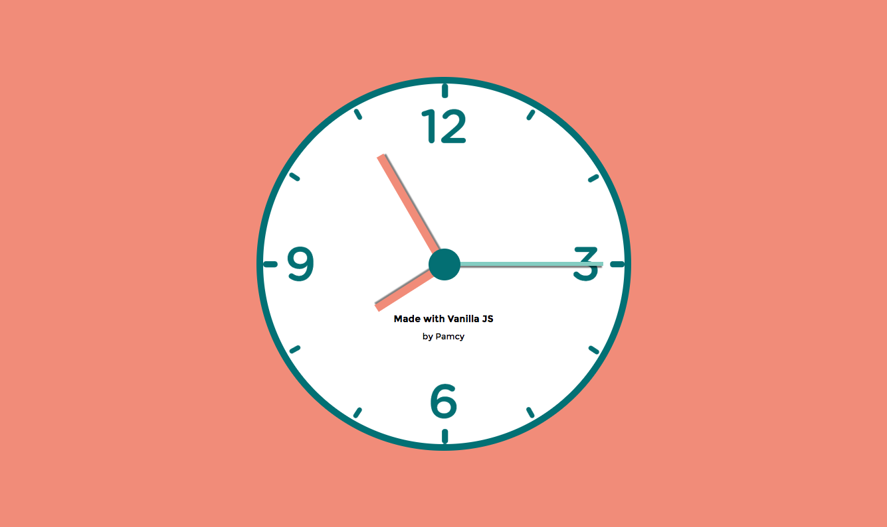

# JS + CSS Clock

This coding challenge is from a online video course by [Wes Bos](https://javascript30.com/). 

With the help of CSS transform's `rotate()` property to exceed 360 degrees and Javascript's built in `Date` function, the functionality of the clock looks great, it has hour, minute and seconds hands move to display the current time.  

[**View Demo**](https://pamcy.github.io/50Websites/27-clock)

