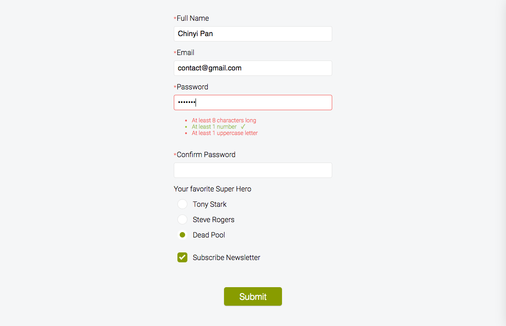

# HTML5 Form Validation with jQuery

Instead of just using HTML5's built-in browser validation, I add additional custom rules to check the inputted value as well. For example I implement the real-time validation by listening to a `input` event,
check if a text input contains special characters using `test()` method to test for a match in `RegExp`, the feedback is displayed when input is focused with CSS `:focus` selector without submitting the form. At last, I will double check that all the fields are valid when the submit button is pushed, if not, it will alert the error message.

PS. It's also fun to learn how to hide the default styles of radio buttons and checkboxes with CSS `appearance: none`, then using `:after` pseudo class to customize my own styles.

[**View Demo**](https://pamcy.github.io/50Websites/31-form-validation)

