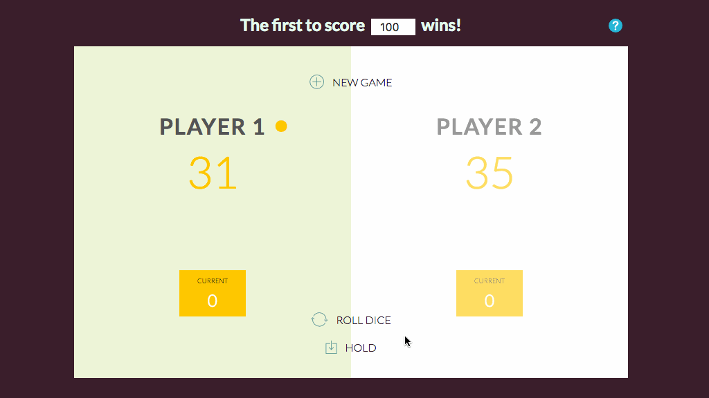

# Pig Dice Game

Pig is a basic dice game completed in pure JS, the first player to score 100 wins the game. I learn how the dice value changes to a new random number each time, with conditional statements to check if all of rules apply.

[**View Demo**](https://pamcy.github.io/50Websites/32-pig-dice-game/)

