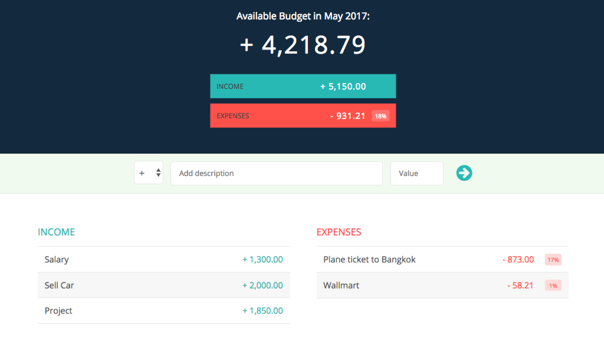

# The Budget App

This challenge is what I learned from The Complete JavaScript Course on [Udemy](https://www.udemy.com/the-complete-javascript-course/). It's a budgeting app that calculates a basic budget based on a list of income and expenses, the most important part I built in the app was the `Module Pattern`, with IIFE, closures and scope concepts to write a well-structure code.

[**View Demo**](https://pamcy.github.io/50Websites/33-budgeting-app/)

