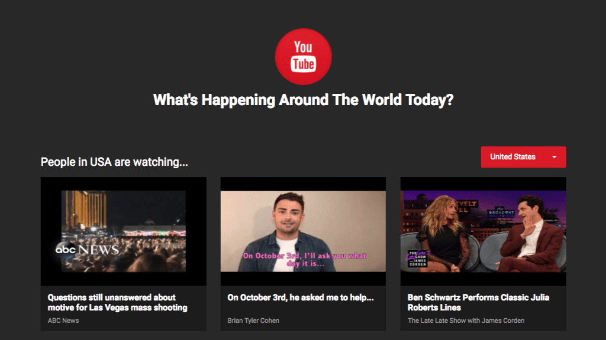

# What's Happening Around The World Today?

Catch the latest popular videos on Youtube from around the world, look over the source code above if you'd like.  

[**View Demo**](https://pamcy.github.io/50Websites/37-youtube-popular-videos)

## What did I learn from this project?

- Webpack  
Minify and concat multiple JS files into one single bundle.

- PostCSS  
Use [LostGrid](http://lostgrid.org/) (easy responsive Grids) and [CssNano](http://cssnano.co/) (css compression) with task runner **Gulp**.

- Youtube API  
Use the [API](https://developers.google.com/youtube/v3/) to fetch all popular videos on Youtube.

- Modal Popup  
Build a popup window to play the video.

- Dropdown Menu  
Select the desired content region from the dropdown list.

- To Top Button  
Allow users to smoothly scroll back to the top of the page.

- File & Directory Structure
