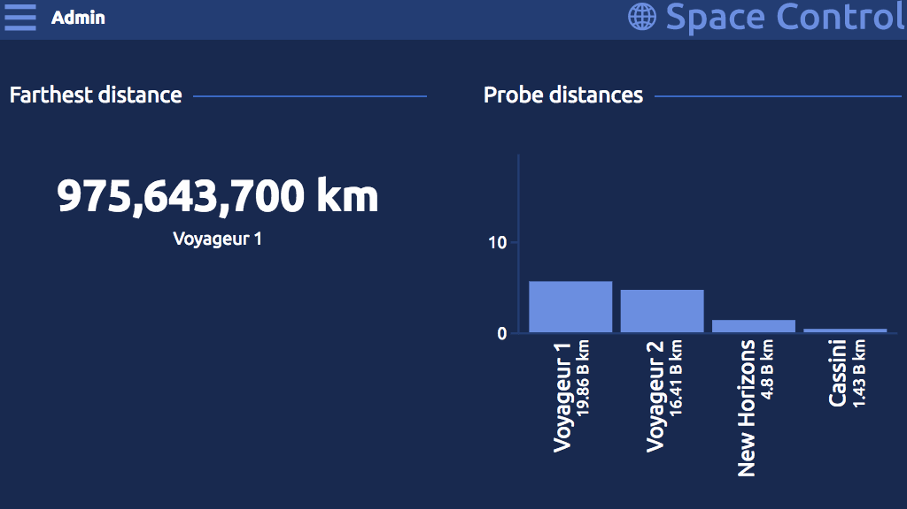

# Responsive Animated Space Control

This coding challenge is from a online tutorial [*Learn the Web*](https://learn-the-web.algonquindesign.ca/).

A full responsive, animated dashboard website with accessibility features.  

[**View Demo**](https://pamcy.github.io/50Websites/39-admin-space-control/)

## What did I learn from this project?

- Responsive  
It's a mobile first website use of *[LostGrid](http://lostgrid.org/)* (A PostCSS Plugin) and *Flexbox*.

- Accessibility  
Add basic accessibility features to the website, include the keyboard accessibility and tab controls.

- Slide In Navigation Menu  
The menu is hidden off screen until the user clicks on a menu icon. (RWD support)

- Animated Bar Chart  
Animate the embedded SVG bar chart with CSS animations.

- Counting numbers  
Make the large distance number count up from zero.

- Resoponsive table design  
Styling data table and make it scrolls horizontally on small screen.

- Tabs  
Swtich between different sections of content with CSS and JS.
