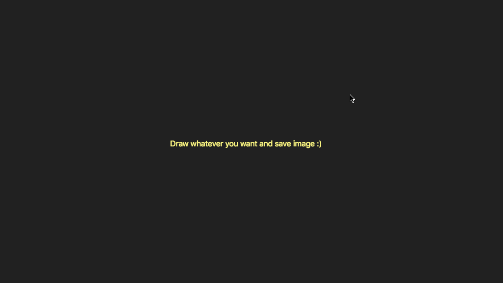

# HTML5 Canvas Drawing Board

This coding challenge is from a online video course by [Wes Bos](https://javascript30.com/).  

A simple drawing board using vanilla javascript and HTML5 Canvas.  

[**View Demo**](https://pamcy.github.io/50Websites/40-canvas-drawing-board/)

## What did I learn from this project?

- Canvas HTML5 element 
Connect and create the path between two points then draw it out. The line is multicolor, and will increase and decrease in width.  

- Mouse events
Attach drawing functions for these events: `mousemove`, `mousedown`, `mouseup`, `mouseout`.  

- HSL color
I understand how it works, so powerful with javascript to control different colors independently.

- Download image
Get the data URL and save the entire canvas content.
