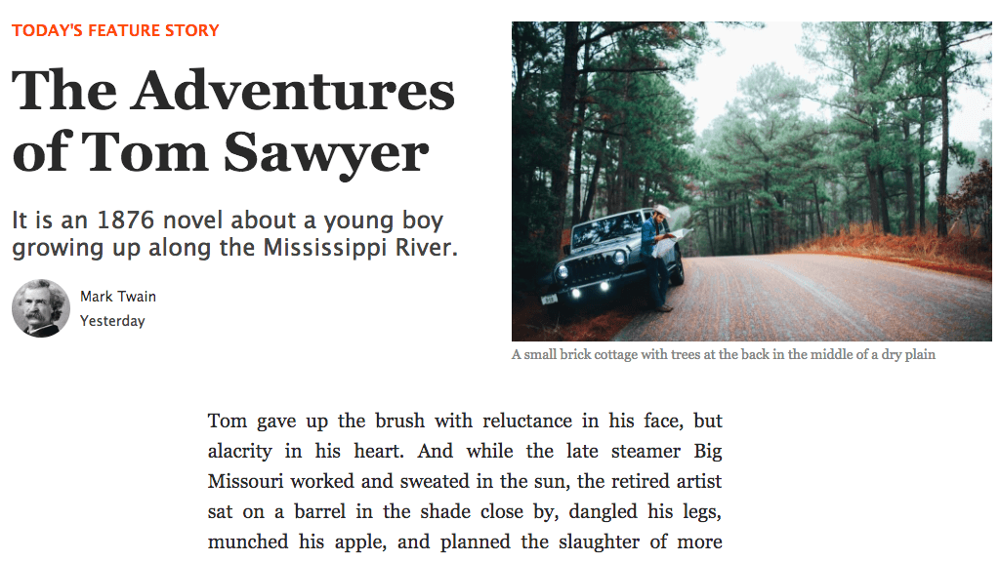

# Responsive Article Layouts with CSS Grid

This project is inspired by the famous Medium article layout using `CSS Grid`, which contains the type of content you'll typically find in Medium. Be sure to shrink or enlarge the browser window to check the responsive design.  

[**View Demo**](https://pamcy.github.io/50Websites/44-css-grid-article-layout/)

